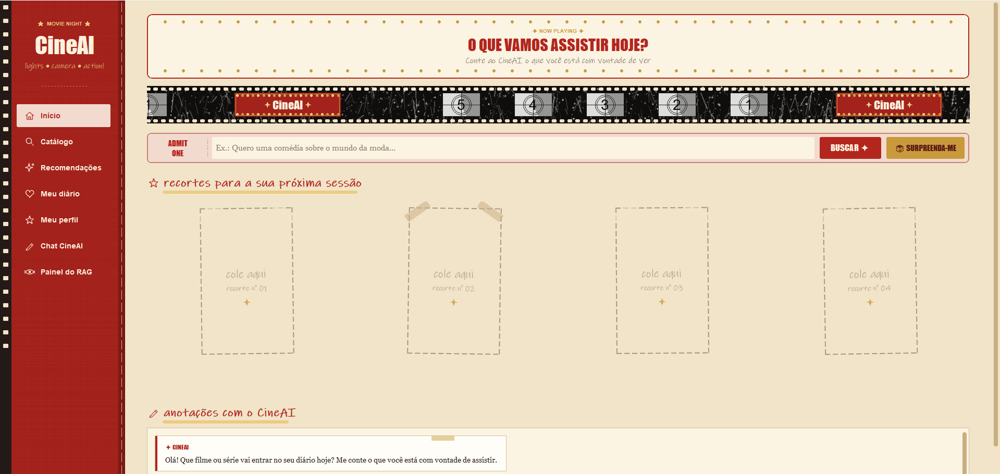
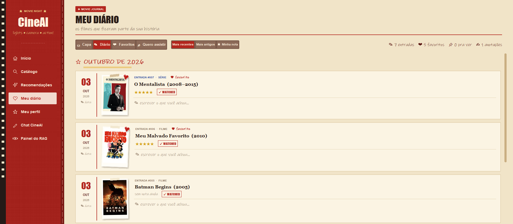
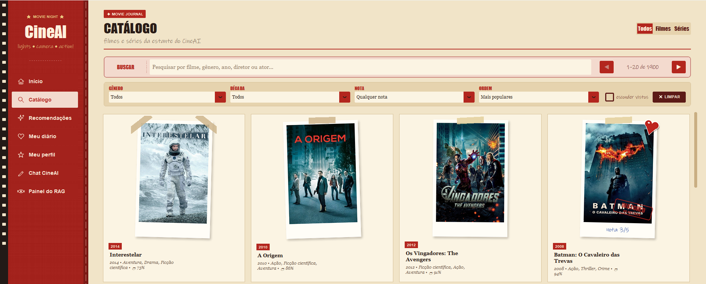
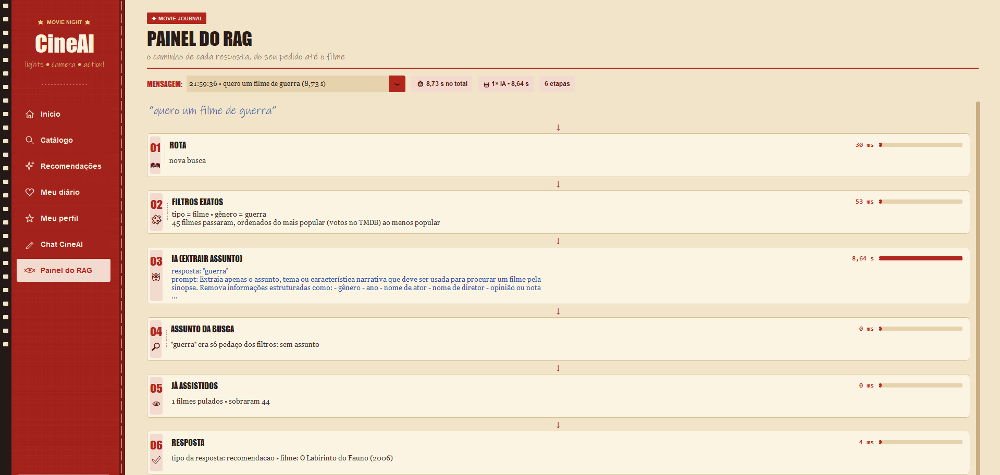

# 🎬 CineAI

Assistente de filmes e séries para desktop, com visual de **diário de cinema** (scrapbook).
Você conversa com o CineAI em português, ele recomenda títulos do catálogo, explica
por que escolheu cada um e aprende o seu gosto pelas notas que você dá.

Projeto pessoal de **Eveliny**, estudante de Ciência da Computação na UNIFOR.

<p align="center">
  
  
</p>
<p align="center">
  
  
</p>

---

## ✨ O que ele faz

- **Chat de recomendações**: "quero uma animação de 2001 com Eddie Murphy", "uma série de comédia",
  "algo mais leve", "um do mesmo diretor", "me surpreenda".
- **Busca por assunto (RAG)**: "um filme sobre um ogro que resgata uma princesa" encontra o título
  pela sinopse, usando embeddings.
- **Painel do RAG**: mostra cada etapa da resposta (regras, filtros, IA, ranking de similaridade)
  e o tempo de cada uma.
- **Catálogo com filmes e séries**: filtros de gênero, década, nota da crítica, ordem e
  "esconder os que já vi".
- **Comparar títulos**: "Breaking Bad ou Interestelar?".
- **Onde assistir**: selinhos dos streamings do Brasil (Netflix, Prime Video, Max, Disney+…) em cada título,
  filtro "que eu assino" no Catálogo e no chat ("uma comédia na Netflix", "tá no Max?").
- **Perfil de gosto**: as estrelas que você dá (1 a 5) formam um perfil por gênero, diretor e ator,
  usado em "me recomenda algo".
- **Meu diário**:
  - **Capa** com o seu nome e as estatísticas (filmes, séries, nota média, horas, gênero e diretor que mais aparecem).
  - **Retrospectiva do ano**: páginas viradas uma a uma com o ano em números, o mês mais cinéfilo,
    o seu gosto, a nota mais alta, uma anotação sua, começo e fim e os títulos revistos
    (botão na Capa ou "como foi meu ano no cinema?" no chat).
  - **Diário em PDF**: capa, números e todas as entradas por mês (pôster, data, estrelas e anotação),
    do diário inteiro ou de um ano, prontas para guardar ou imprimir (em `dados/exportados/`).
  - **Diário automático**: cada título visto vira uma entrada com data (editável), estrelas e a sua anotação,
    separada por mês. Viu de novo? **"↻ vi de novo"** cria outra entrada, com outra data e outra anotação.
  - **Favoritos** e **Quero assistir** (uma checklist: marcar ☐ leva o título para o diário).
- **Suas anotações viram recomendação**: o que você escreve no diário entra na busca por embeddings,
  e as estrelas dizem se aquilo é algo que você quer mais ou menos ("me recomenda pelo que eu escrevi").
- **Trailers**, notas do IMDb / Rotten Tomatoes e títulos semelhantes em cada página.
- **Detalhes de papel**: polaroides tortas com fita, adesivo de coração nos favoritos, carimbo WATCHED
  e uma página que vira ao abrir um filme.

## 🧠 Como funciona

1. **Regras primeiro**: saudações, perguntas sobre o filme atual ("quem dirigiu?"), notas e
   pedidos relativos são resolvidos sem IA, de forma rápida e previsível.
2. **Filtros exatos**: gênero, ano, década, diretor, ator e tipo (filme/série) são detectados no texto.
3. **IA local (Ollama, qwen3:1.7b)**: quando é preciso, extrai o *assunto* do pedido.
4. **Busca semântica**: o assunto é comparado com as sinopses (sentence-transformers,
   similaridade de cosseno + bônus por palavras em comum).
5. **Ranking**: o resultado é ordenado pela qualidade e pelo seu perfil (gêneros, diretores,
   sinopses que você curtiu e as suas anotações do diário, comparadas com o catálogo em desvios-padrão).

## 🛠️ Tecnologias

Python · customtkinter · Pillow · sentence-transformers · NumPy · Ollama · API do TMDB · API da OMDb

---

## 🚀 Como rodar

### 1. Instalar as bibliotecas

```bash
pip install -r requirements.txt
```

### 2. Instalar a IA local

Instale o [Ollama](https://ollama.com) e baixe o modelo:

```bash
ollama pull qwen3:1.7b
```

### 3. Configurar as chaves (só para importar o catálogo)

Copie o arquivo `.env.example` para `.env` e coloque suas chaves:

```
TMDB_API_KEY=sua_chave_tmdb_aqui
OMDB_API_KEY=sua_chave_omdb_aqui
```

> O `.env` nunca vai para o GitHub (está no `.gitignore`).

### 4. Baixar os pôsteres e montar o catálogo

```bash
python importadores/importar_tmdb.py          # filmes + pôsteres
python importadores/importar_series.py        # séries + pôsteres
python importadores/importar_avaliacoes.py    # IMDb / Rotten Tomatoes (limite de 1.000 por dia no plano grátis)
python importadores/importar_trailers.py      # trailers que faltarem
python importadores/importar_onde_assistir.py # em quais streamings do Brasil cada título está
```

### 5. Abrir o CineAI

```bash
python main.py
```

Na primeira vez ele calcula os embeddings do catálogo (demora um pouco); depois fica salvo
em `dados/embeddings_cache.pkl`.

---

## ✅ Testes

```bash
python testes/testes.py              # modo rápido: catálogo pequeno de teste, sem IA de verdade
python testes/testes.py --completo   # usa o catálogo real
```

Os testes usam uma pasta temporária e **nunca mexem** no seu `usuario.json` nem no `conversas.json`.

---

## 📁 Estrutura

```
assistente_filmes/
├── main.py            ← abre o CineAI (python main.py)
├── cineai/            ← o programa
│   ├── interface.py   janela (chat, catálogo, diário, painel do RAG)
│   ├── filmes.py      cérebro: regras, filtros, busca semântica e respostas
│   ├── perfil.py      perfil de gosto (notas, favoritos e anotações)
│   ├── usuario.py     favoritos, diário, notas e anotações (dados/usuario.json)
│   ├── conversas.py   conversas salvas (dados/conversas.json)
│   ├── diario_pdf.py  exporta o diário em PDF (dados/exportados/)
│   ├── rastreio.py    etapas de cada resposta para o Painel do RAG
│   └── caminhos.py    onde fica cada arquivo
├── importadores/      ← montam o catálogo a partir do TMDB e da OMDb
├── dados/             ← catálogo (filmes.json), pôsteres e os seus dados
├── testes/            ← testes automáticos
└── docs/              ← prints do README
```

---

## 📜 Créditos

Este produto usa a API do TMDB, mas não é endossado nem certificado pelo
[TMDB](https://www.themoviedb.org). Notas do IMDb, Rotten Tomatoes e Metacritic via
[OMDb API](https://www.omdbapi.com). Dados de streaming: [JustWatch](https://www.justwatch.com) (via TMDB).